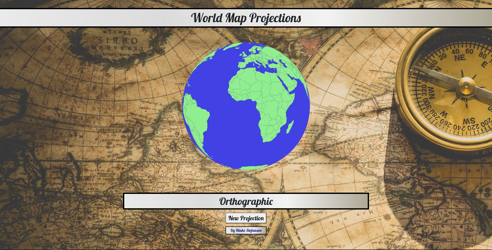

# World Map Projections
A web app that allows users to see various map projections

## Why
I built this project to play around with D3 and to try out the different map projections offered

## Features
- Users can visualize the differences in map projections on a world map
- Users can select different map projections
- Users can mouseover the map and see the names of each country

## Demo
Link to <a href="https://bstefansen.github.io/worldMapProjections/">Production Build</a>
